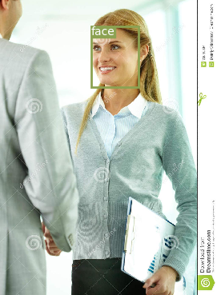
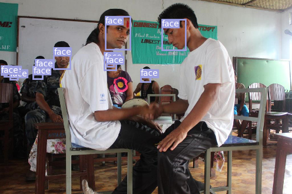
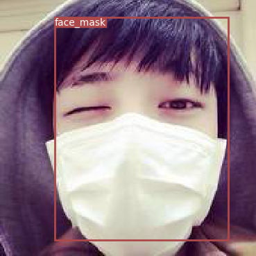
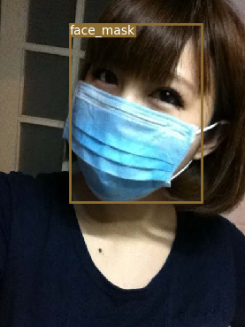
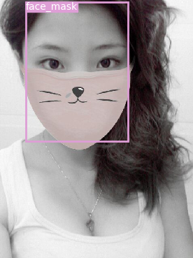
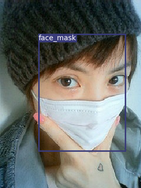
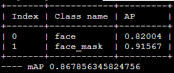
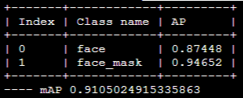

## 说明
PyTorch-YOLOv3
原作者：https://github.com/eriklindernoren/PyTorch-YOLOv3

使用改进的yolov3来进行口罩检测
在原始项目的基础上增加了一下改变：
	1.加入了DropBlock和Label Smoothing的
	2.加入了Gridmask和mosaic数据增强

## Installation
	$ cd YoloV3/
    $ sudo pip3 install -r requirements.txt
	$ cd weights/
    $ bash download_weights.sh
	
## Download data
	链接：https://pan.baidu.com/s/1o3zUOicC9HEJpgja4nr-eQ 
	提取码：b6uh
	将数据集解压到data下面

## Train
	$ python3 train.py --model_def config/yolov3-custom.cfg --data_config config/custom.data --regular_mode 3 --mode 3

## 1.单独使用DropBlock和Label Smotthing
	$ python3 train.py --model_def config/yolov3-custom.cfg --data_config config/custom.data --regular_mode 3

## 2.单独使用Gridmask和mosaic数据增强
	$ python3 train.py --model_def config/yolov3-custom.cfg --data_config config/custom.data --mode 3

## Test
    $ python test.py --weights_path checkpoints/yolov3_ckpt.pth
	
## Inference
	$ python3 detect.py
	

	

	

## 对比结果
原始

改进

